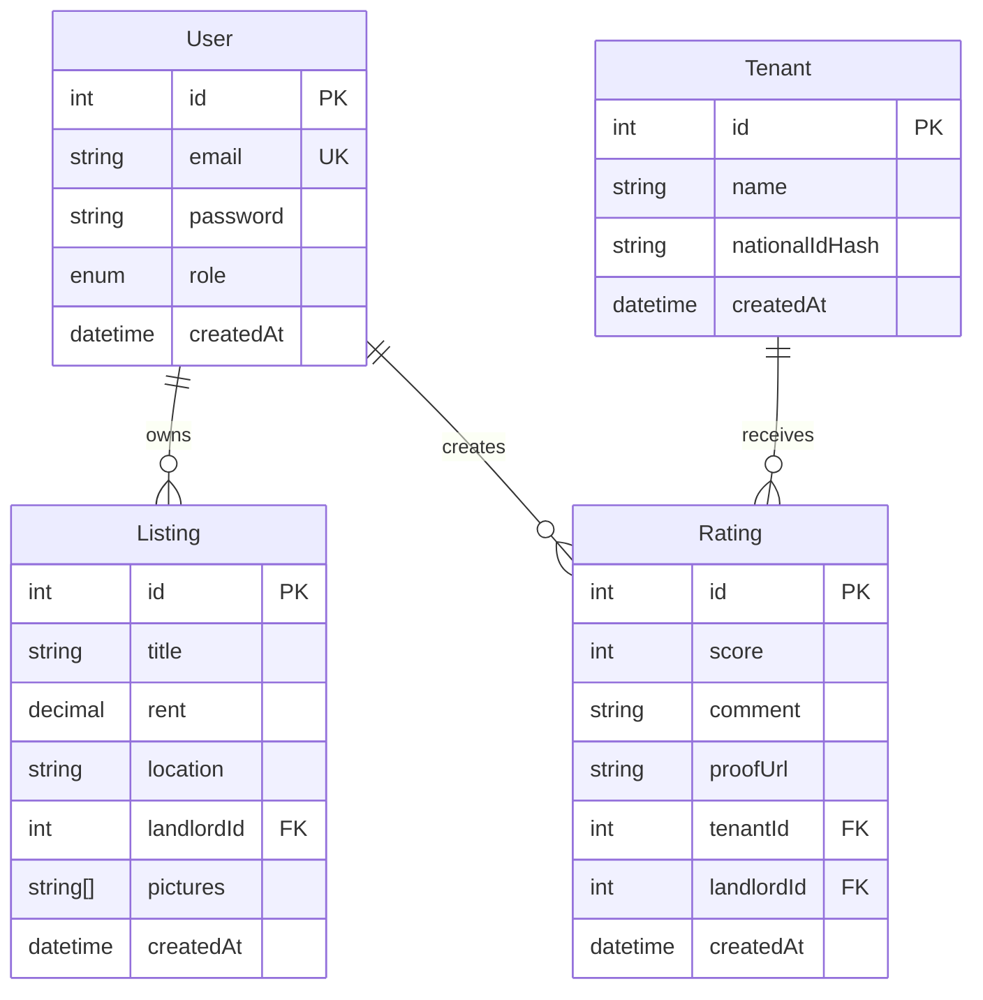

# RentGuard - Malaysian Landlord & Tenant Rating Platform

A comprehensive platform for Malaysian landlords to rate tenants and manage property listings.

## 🚀 Quick Start

### Prerequisites
- Docker & Docker Compose
- Node.js 20+ (for local development)

### Development Setup

1. **Clone and setup environment**:
```bash
git clone <repo-url>
cd rent-guard
cp .env.example .env
# Edit .env with your preferred values
```

2. **Start all services**:
```bash
chmod +x scripts/dev.sh
./scripts/dev.sh
```

3. **Access the application**:
- Frontend: http://localhost:3000
- Backend API: http://localhost:3001
- MinIO Console: http://localhost:9001 (minioadmin/minioadmin)
- Database: localhost:5432

### Manual Setup (Alternative)

```bash
# Start infrastructure
docker compose up -d db minio

# Backend setup
cd backend
npm install
npx prisma migrate dev
npx prisma db seed
npm run start:dev

# Frontend setup (new terminal)
cd frontend
npm install
npm run dev
```

## 📚 API Documentation

### Authentication
- `POST /auth/register` - Register new landlord
- `POST /auth/login` - Login and get JWT token

### Users
- `GET /users/profile` - Get current user profile
- `PUT /users/profile` - Update user profile

### Tenants
- `GET /tenants` - Search tenants (public)
- `POST /tenants` - Create tenant record
- `GET /tenants/:id` - Get tenant details
- `POST /tenants/:id/ratings` - Rate a tenant

### Listings
- `GET /listings` - Get all listings (with filters)
- `POST /listings` - Create new listing (landlord only)
- `GET /listings/:id` - Get listing details
- `PUT /listings/:id` - Update listing (owner only)
- `DELETE /listings/:id` - Delete listing (owner only)

### File Upload
- `POST /upload/images` - Upload property images to MinIO

## 🗄️ Database Schema



## 🏗️ Architecture

- **Backend**: NestJS 11 + Prisma + PostgreSQL
- **Frontend**: Next.js 15 (App Router) + TailwindCSS
- **Storage**: MinIO (S3-compatible) for images
- **Auth**: JWT + bcrypt with role-based access
- **Deployment**: Docker Compose with Nginx reverse proxy

## 🧪 Testing

```bash
# Backend tests
cd backend
npm run test
npm run test:e2e

# Frontend e2e tests
cd frontend
npm run test:e2e
```

## 🔧 Development

### Code Quality
- ESLint + Prettier configured
- Husky pre-commit hooks
- TypeScript strict mode

### Environment Variables
See `.env.example` for all required environment variables.

## 📦 Deployment

```bash
# Production build
docker compose -f docker-compose.yml -f docker-compose.prod.yml up -d
```

## 🤝 Contributing

1. Fork the repository
2. Create feature branch (`git checkout -b feature/amazing-feature`)
3. Commit changes (`git commit -m 'Add amazing feature'`)
4. Push to branch (`git push origin feature/amazing-feature`)
5. Open Pull Request

## 📄 License

This project is licensed under the MIT License. 